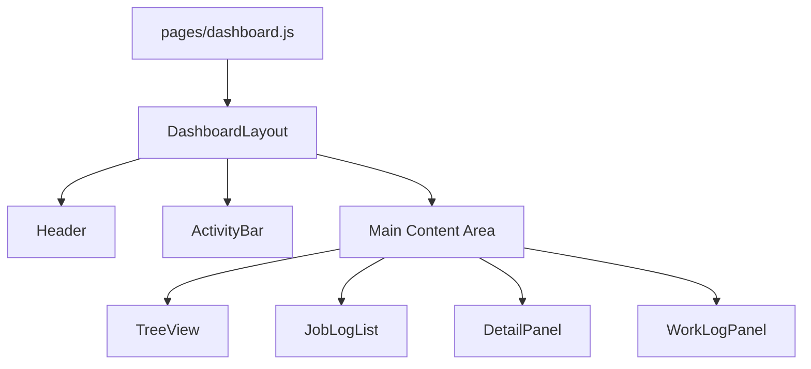

# Design: Dashboard Layout Refactor

## Architecture Overview



## Component Structure

### DashboardLayout

```
components/
└── layouts/
    └── DashboardLayout.js  [NEW]
```

**Props:**

- `user` - Current user object
- `onLogout` - Logout handler function
- `activeSection` - Current active section ("applications" | "worklogs")
- `onSectionChange` - Section change handler
- `children` - Main content area

### JobLogList (replaces JobLogForm)

```
components/
└── dashboard/
    ├── JobLogList.js       [NEW]
    └── JobLogForm.js       [DELETE]
```

**Props:**

- `logs` - Array of log entries
- `applicationId` - Parent application ID
- `onLoadMore` - Callback for infinite scroll pagination
- `hasMore` - Boolean indicating more logs available
- `onAddLog` - Callback for adding new log
- `onUpdateLog` - Callback for updating existing log
- `isLoading` - Loading state indicator

## Data Flow

### Auto-save with Debounce

```
User Types → Start Timer → 1 second → API Update → Toast Notification
                ↑
                └── Reset Timer on new keystroke
```

### Infinite Scroll

```
Scroll Near Top → Check hasMore → Load Older Logs → Prepend to List
                                                  → Maintain Scroll Position
```

## State Management

### Local State in JobLogList

- `editingLogId` - ID of log being edited (null if none)
- `editContent` - Current edit content
- `pendingSave` - Timer reference for debounce

### Parent Dashboard State (unchanged)

- `applicationLogs` - Logs keyed by application ID
- Continue using existing state management

## API Considerations

Current `listJobApplicationLogs` returns all logs. For true infinite scroll:

- Could add pagination params (offset, limit)
- For now, implement client-side chunking (show last N, load more on scroll)

## Toast Notifications

Using react-toastify for:

- Save success: `toast.success("Log saved")`
- Save error: `toast.error(error.message)`
- Delete confirmation: Native browser confirm (keep as is)

## UI/UX Design

### Log Entry Card

```
┌─────────────────────────────────────────┐
│ [Datetime Badge]       [Process Name]   │
│ ─────────────────────────────────────── │
│ Log content text...                     │
│ (editable with contentEditable or       │
│  click-to-edit pattern)                 │
│ ─────────────────────────────────────── │
│ [Audio URL link if present]             │
└─────────────────────────────────────────┘
```

### Input Bar (fixed at bottom)

```
┌─────────────────────────────────────────┐
│ [Datetime Picker] [Text Input     ] [+] │
└─────────────────────────────────────────┘
```
